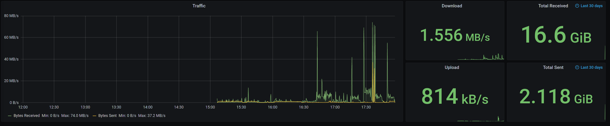

# Fritzbox Dashboard

A quick grafana dashboard for my Fritzbox router, using Knative eventing and Drogue IoT stuff.

Looks something like this:

## Setup

* Podman: running [Fritzbox Agent](https://github.com/ctron/fritzbox-agent) next to the Fritzbox
* Knative eventing:
  * Drogue Cloud HTTP Endpoint
  * Kafka Topic
  * Influx DB pusher
* Grafana & InfluxDB
